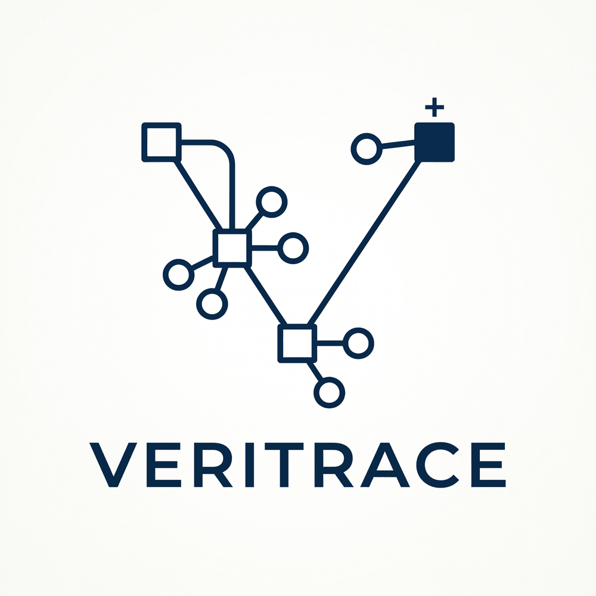

# VERITRACE

[Access here](https://veritrace-chi.vercel.app/)

**The AI fact-checker that shows its work. You make the call.**

VERITRACE is an observability workbench for fact-checking. Paste a claim and an AI decomposes it into atomic sub-claims, writes the exact questions needed to resolve each, and retrieves live **primary sources** to answer them — laying the entire reasoning trail bare as a traversable evidence graph that builds itself in real time. Verdicts are advisory only: every step traces to a source you can open, so the journalist — not the model — makes the final call.

Built by Gustavo Araujo Costa ([@noah-art3mis](https://github.com/noah-art3mis)) for Platanus Build Night — Ciudad de México.

## What makes it different

- **Process-based explainability.** The explanation *is* the evidence trail, not a paragraph the model invents after the fact. Zero-shot LLM fact-check rationales are routinely unfaithful — convincing but disconnected from the real reasoning — so VERITRACE never asks you to trust a verdict you can't trace. Interviews with professional fact-checkers found they want exactly this: transparency and replicability into *how* a system reached its conclusion, not just a label ([Warren, Shklovski & Augenstein, 2025](https://doi.org/10.1145/3706598.3713277)).
- **Nuanced verdicts.** AVeriTeC's 4-way labels — **Supported / Refuted / Conflicting / Not-Enough-Evidence** — never bare true/false. When it can't verify a claim it returns Not-Enough-Evidence instead of guessing; that honesty is the point.
- **Human-in-the-loop.** The model does the analysis and makes it granularly observable; the fact-checker exercises final judgment. Accountability stays human.

## How it works

The pipeline streams a four-layer **evidence graph**, live, as it runs:

```
Source text  →  Claims  →  Questions  →  Evidence  →  Verdict
```

1. **Decompose** — extract atomic, decontextualized claims from the pasted text (date / place / actor injected so each claim stands alone and is searchable).
2. **Question** — generate the specific questions a fact-checker would ask to resolve each claim.
3. **Retrieve** — fan out live searches for primary sources via Exa, scoring each source's reliability.
4. **Verdict** — propose an advisory label per claim, then aggregate to a source-level assessment.

Each card flies into the graph the moment its stage completes; a claim's verdict resolves as soon as its last question answers.

## Methodology

The full pipeline, the de-novo retrieval honesty bar, the AVeriTeC verdict taxonomy, what this build can and can't check, and the complete research grounding live on the in-app [**Methodology & References** page](https://veritrace-chi.vercel.app/methodology).

## References

- Warren, G., Shklovski, I., & Augenstein, I. (2025). Show Me the Work: Fact-Checkers' Requirements for Explainable Automated Fact-Checking. *Proceedings of the 2025 CHI Conference on Human Factors in Computing Systems*, 1–21. https://doi.org/10.1145/3706598.3713277